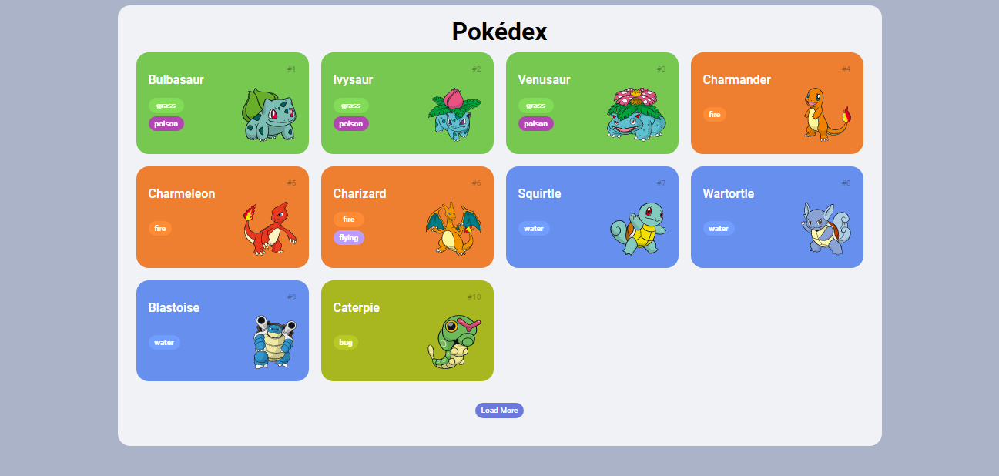

<h1 align="center"> Dio.me - Bootcamp OrangeTech + Inter </h1>

Evento exclusivo e gratuito, promovido pela Digital Innovation One para ensino de Javascript.

  <a href="#-tecnologias">Tecnologias</a>&nbsp;&nbsp;&nbsp;|&nbsp;&nbsp;&nbsp;
  <a href="#-projeto">Projeto</a>&nbsp;&nbsp;&nbsp;|&nbsp;&nbsp;&nbsp;
  <a href="#memo-licença">Licença</a>

  

 

  

## 🚀 Tecnologias

Esse projeto foi desenvolvido com as seguintes tecnologias:

- HTML e CSS
- JavaScript
- Git e Github

## 💻 Projeto

Desenvolvimento de uma pokédex com consumo de uma API Rest para mostrar os pokémons da primeira geração e os detalhes deles. 

## :memo: Licença

Esse projeto está sob a licença MIT.

---